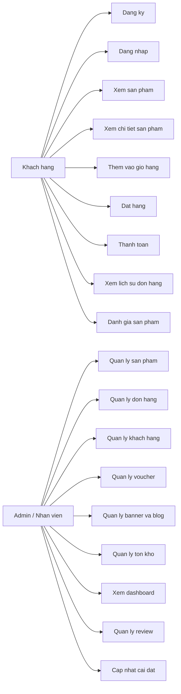
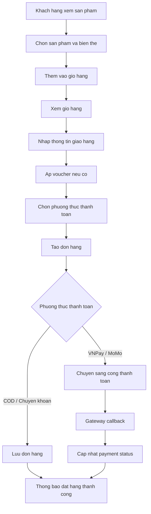
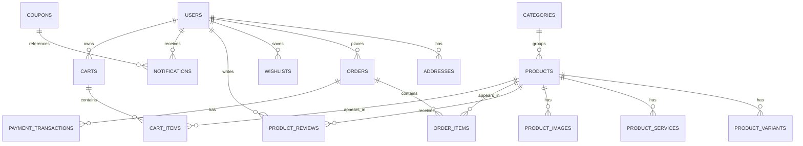

# Bida Shop Customer UI Refresh

## 1. Giới thiệu đề tài
Đề tài xây dựng hệ thống bán hàng trực tuyến cho cửa hàng bida, bao gồm website khách hàng và trang quản trị nội bộ. Hệ thống hỗ trợ trưng bày sản phẩm, quản lý giỏ hàng, đặt hàng, thanh toán, quản lý nội dung và vận hành bán hàng trên cùng một nền tảng.

Mục tiêu của đề tài là số hóa quy trình bán hàng cho một cửa hàng chuyên ngành bida, nơi sản phẩm có nhiều biến thể như trọng lượng, đầu cơ, phụ kiện đi kèm và yêu cầu quản lý tồn kho khá chi tiết.

## 2. Lý do chọn đề tài
- Thương mại điện tử tiếp tục là xu hướng chủ đạo trong bán lẻ, kể cả với các ngành hàng ngách như dụng cụ bida.
- Khách hàng hiện có nhu cầu xem thông tin sản phẩm, so sánh giá, đặt hàng và thanh toán online thay vì mua trực tiếp hoàn toàn tại cửa hàng.
- Cửa hàng bida cần một hệ thống quản lý tập trung để theo dõi sản phẩm, đơn hàng, khách hàng, voucher, đánh giá và nội dung truyền thông.
- Dự án có tính thực tế cao vì mô phỏng đầy đủ quy trình bán hàng: từ xem sản phẩm, thêm giỏ hàng, áp mã giảm giá, tạo đơn, đến quản trị vận hành ở phía admin.

## 3. Mục tiêu hệ thống
- Xây dựng website bán hàng cho khách với giao diện dễ sử dụng.
- Cho phép khách hàng đăng ký, đăng nhập và quản lý tài khoản.
- Hiển thị danh mục sản phẩm, chi tiết sản phẩm, đánh giá, bài viết và banner quảng bá.
- Hỗ trợ giỏ hàng cho cả khách vãng lai và người dùng đã đăng nhập.
- Hỗ trợ đặt hàng với nhiều hình thức thanh toán như `COD`, `chuyển khoản`, `VNPay`, `MoMo`.
- Xây dựng trang quản trị để quản lý sản phẩm, đơn hàng, khách hàng, voucher, tồn kho, review, banner, blog và cài đặt chung.
- Quản lý dữ liệu tập trung trên cơ sở dữ liệu `SQL Server`.

## 4. Phạm vi hệ thống
### 4.1. Hệ thống thực hiện
- Quản lý tài khoản khách hàng và tài khoản nội bộ `admin`, `manager`, `warehouse`, `cskh`.
- Quản lý danh mục, sản phẩm, biến thể sản phẩm, dịch vụ đi kèm, hình ảnh sản phẩm.
- Xử lý giỏ hàng, hợp nhất giỏ hàng khách vãng lai với tài khoản đã đăng nhập.
- Tạo đơn hàng, theo dõi trạng thái đơn hàng và trạng thái thanh toán.
- Áp dụng voucher và kiểm tra ràng buộc sử dụng voucher.
- Quản lý banner, bài viết blog, đánh giá sản phẩm, wishlist, địa chỉ giao hàng, thông báo khách hàng.
- Tích hợp cổng thanh toán `VNPay`, `MoMo` ở mức callback/API.

### 4.2. Hệ thống chưa thực hiện hoặc chưa hoàn thiện
- Chưa có ứng dụng mobile riêng.
- Chưa tích hợp hệ thống vận chuyển bên thứ ba theo thời gian thực.
- Chưa có xác thực email bằng OTP hoặc link kích hoạt; hiện mới kiểm tra định dạng email Gmail.
- Chưa có tích hợp AI thực tế trong quy trình bán hàng.
- Chưa có dashboard BI chuyên sâu hoặc báo cáo nâng cao ngoài dashboard quản trị hiện tại.

## 5. Công nghệ sử dụng
- Frontend: `HTML5`, `CSS3`, `JavaScript thuần (Vanilla JS)`.
- Backend: `Node.js`, `Express.js`.
- Database: `Microsoft SQL Server`.
- Xác thực: `JWT`, `bcryptjs`.
- Upload file: `multer`.
- Kết nối cơ sở dữ liệu: `mssql`.
- Cấu hình môi trường: `dotenv`.
- Email xác thực: cấu hình SMTP với `SMTP_HOST`, `SMTP_PORT`, `SMTP_SECURE`, `SMTP_USER`, `SMTP_PASS`, `SMTP_FROM`.
  - Gmail: `SMTP_HOST=smtp.gmail.com`, `SMTP_PORT=465`, `SMTP_SECURE=true`, `SMTP_USER=<your@gmail.com>`, `SMTP_PASS=<app-password>`.
  - Gmail App Password: cần bật xác thực 2 bước và tạo mật khẩu ứng dụng trong tài khoản Google.
- Giao tiếp hệ thống: `REST API`, `Fetch API`.
- Thanh toán: `VNPay`, `MoMo`, `VietQR` cho ảnh QR chuyển khoản.
- Triển khai backend: `Docker`.

Lưu ý: dự án thực tế này không dùng `ReactJS`, `MongoDB` hay `MySQL`.

## 6. Phân tích hệ thống
### 6.1. Đối tượng sử dụng
#### Admin
- Quản lý toàn bộ hệ thống.
- Quản lý sản phẩm, đơn hàng, khách hàng, voucher, bài viết, banner, review, cài đặt.
- Theo dõi dashboard doanh thu và tình trạng tồn kho.

#### Khách hàng
- Đăng ký, đăng nhập tài khoản.
- Xem sản phẩm, tìm kiếm, lọc và xem chi tiết sản phẩm.
- Thêm sản phẩm vào giỏ hàng, đặt hàng và thanh toán.
- Quản lý địa chỉ, wishlist, đơn hàng, đánh giá sản phẩm và thông báo.

### 6.2. Chức năng chính
- Đăng ký / đăng nhập.
- Xem danh sách sản phẩm và chi tiết sản phẩm.
- Tìm kiếm, lọc, sắp xếp sản phẩm.
- Quản lý giỏ hàng.
- Áp mã giảm giá.
- Thanh toán và tạo đơn hàng.
- Theo dõi đơn hàng.
- Đánh giá sản phẩm sau khi mua.
- Quản lý sản phẩm ở trang admin.
- Quản lý đơn hàng, khách hàng, voucher, nội dung và tồn kho ở trang admin.

## 7. Thiết kế hệ thống
### 7.1. Use Case Diagram


### 7.2. Activity Diagram
Ví dụ luồng mua hàng:



### 7.3. ERD (Database)
Các bảng cốt lõi của hệ thống:
- `users`
- `categories`
- `products`
- `product_variants`
- `product_services`
- `product_images`
- `carts`
- `cart_items`
- `orders`
- `order_items`
- `payment_transactions`
- `coupons`
- `addresses`
- `wishlists`
- `product_reviews`
- `notifications`
- `settings`
- `banners`
- `blog_posts`
- `inventory_receipts`

ERD rút gọn:



### 7.4. Thiết kế giao diện (UI)
Hệ thống có hai nhóm giao diện chính:
- Giao diện khách hàng: `index.html`, `products.html`, `product.html`, `cart.html`, `account.html`, `info.html`, `blog.html`, `review.html`.
- Giao diện quản trị: `admin.html`.

Mô tả nhanh:
- Trang khách hiển thị banner, danh mục, danh sách sản phẩm, chi tiết sản phẩm và blog.
- Trang giỏ hàng hỗ trợ chọn sản phẩm, áp voucher và tạo đơn.
- Trang tài khoản hỗ trợ đăng nhập, đăng ký, quản lý địa chỉ, wishlist, lịch sử mua hàng và đánh giá.
- Trang admin hỗ trợ dashboard, CRUD sản phẩm, quản lý đơn hàng, khách hàng, voucher, nội dung, tồn kho và review.

Có thể bổ sung ảnh chụp màn hình thực tế của các trang vào báo cáo hoặc README khi cần.

## 8. Triển khai hệ thống
### 8.1. Kiến trúc hệ thống
Hệ thống triển khai theo mô hình `Client - Server`.

- Client:
  - Website khách hàng và admin chạy bằng `HTML/CSS/JS`.
  - Gọi dữ liệu thông qua `REST API`.
- Server:
  - `Node.js + Express` xử lý nghiệp vụ.
  - Kết nối `SQL Server` để lưu trữ dữ liệu.
- Database:
  - Lưu thông tin người dùng, sản phẩm, đơn hàng, giỏ hàng, review, nội dung, voucher.

Luồng tổng quát:

```text
Frontend (Browser)
    -> Fetch API
Backend (Express REST API)
    -> mssql
SQL Server Database
```

### 8.2. Cấu trúc thư mục
```text
frontend/
  account.html
  admin.html
  blog.html
  cart.html
  index.html
  info.html
  product.html
  products.html
  review.html
  assets/
    frontend.js
    admin.js
    store.js
    styles.css

backend/
  package.json
  Dockerfile
  scripts/
    migrate.js
    seed.js
  sql/
    schema.sql
  src/
    server.js
    lib/
      auth.js
      db.js
      env.js
      http.js
    middleware/
      auth.js
      error.js
    routes/
      public.js
      auth.js
      cart.js
      orders.js
      admin.js
    services/
      payments/
        momo.js
        vnpay.js
```

### 8.3. Mô tả các chức năng chính
#### Đăng nhập hoạt động như thế nào
- Người dùng nhập email và mật khẩu ở giao diện khách .
- Frontend gửi `POST /api/auth/login`.
- Backend kiểm tra email trong bảng `users`.
- Mật khẩu được đối chiếu bằng `bcryptjs`.
- Nếu hợp lệ, backend sinh `JWT`.
- Frontend lưu token vào `localStorage` để dùng cho các request tiếp theo.

#### Thêm vào giỏ hàng
- Người dùng chọn sản phẩm, biến thể và dịch vụ đi kèm.
- Frontend gửi `POST /api/cart/items`.
- Nếu người dùng chưa đăng nhập, hệ thống tạo `guest token`.
- Nếu đã đăng nhập, giỏ hàng gắn với tài khoản người dùng.
- Backend kiểm tra tồn kho, tính đơn giá, lưu dữ liệu vào `carts` và `cart_items`.
- Frontend cập nhật số lượng và cache giỏ hàng trên trình duyệt.

#### Thanh toán
- Khách nhập thông tin nhận hàng và chọn phương thức thanh toán.
- Frontend gửi `POST /api/orders/checkout`.
- Backend kiểm tra thông tin khách hàng, giỏ hàng, tồn kho và voucher.
- Hệ thống tạo bản ghi đơn hàng trong `orders` và `order_items`.
- Nếu chọn `COD` hoặc `chuyển khoản`, đơn được tạo ngay.
- Nếu chọn `VNPay` hoặc `MoMo`, hệ thống trả về `redirectUrl` để chuyển sang cổng thanh toán.
- Khi thanh toán thành công, callback từ cổng thanh toán cập nhật `payment_status`.

## 9. Hướng dẫn chạy dự án
### 9.1. Yêu cầu
- `Node.js 20+`
- `SQL Server`
- `SSMS` hoặc công cụ quản trị SQL Server

### 9.2. Cấu hình backend
Tạo file `.env` trong thư mục `backend`:

```env
PORT=4000
JWT_SECRET=replace-with-long-random-secret
APP_BASE_URL=http://localhost:8080
FRONTEND_URL=http://localhost:8080

DB_SERVER=localhost
DB_PORT=1433
DB_NAME=BidaShopDB
DB_USER=sa
DB_PASSWORD=YourStrongPassword123!
DB_ENCRYPT=false
DB_TRUST_SERVER_CERT=true

SMTP_HOST=smtp.gmail.com
SMTP_PORT=465
SMTP_SECURE=true
SMTP_USER=your-gmail@gmail.com
SMTP_PASS=your-16-char-app-password
SMTP_FROM=your-gmail@gmail.com
```

### 9.3. Tạo database
```sql
CREATE DATABASE BidaShopDB;
```

### 9.4. Chạy backend
```bash
cd backend
npm install
npm run migrate
npm run seed
npm run smtp:test -- your-real-email@example.com
npm run dev
```

### 9.5. Chạy frontend
```bash
cd frontend
python -m http.server 8080
```

### 9.6. Đường dẫn truy cập
- Khách hàng: `http://localhost:8080/index.html`
- Quản trị: `http://localhost:8080/admin.html`
- API: `http://localhost:4000/api`

## 10. Tài khoản mẫu
- `admin@bidaproshop.vn / admin123`
- `manager@bidaproshop.vn / manager123`
- `kho@bidaproshop.vn / kho123`
- `cskh@bidaproshop.vn / cskh123`
- `khach1@example.com / 123456`

## 11. Kết luận
Hệ thống đáp ứng được bài toán cơ bản của một website bán hàng chuyên ngành bida với hai phần chính là website khách hàng và trang quản trị. Dự án có đầy đủ các thành phần quan trọng của một hệ thống thương mại điện tử thực tế: xác thực người dùng, quản lý sản phẩm, giỏ hàng, đơn hàng, thanh toán, voucher, nội dung và theo dõi vận hành nội bộ.

Trong tương lai, hệ thống có thể mở rộng thêm các chức năng như xác thực email OTP, tích hợp đơn vị vận chuyển, AI tư vấn sản phẩm, mobile app và báo cáo kinh doanh nâng cao.
